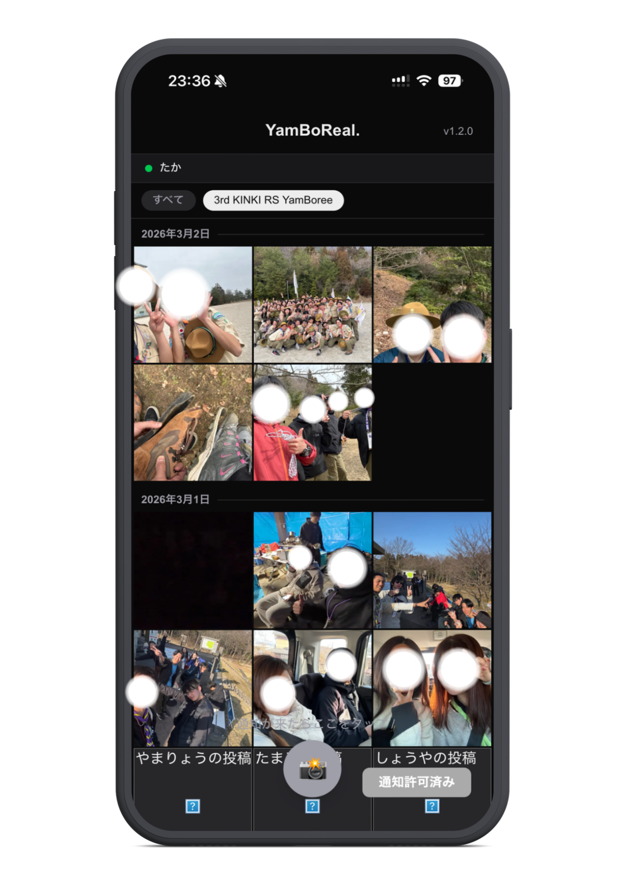
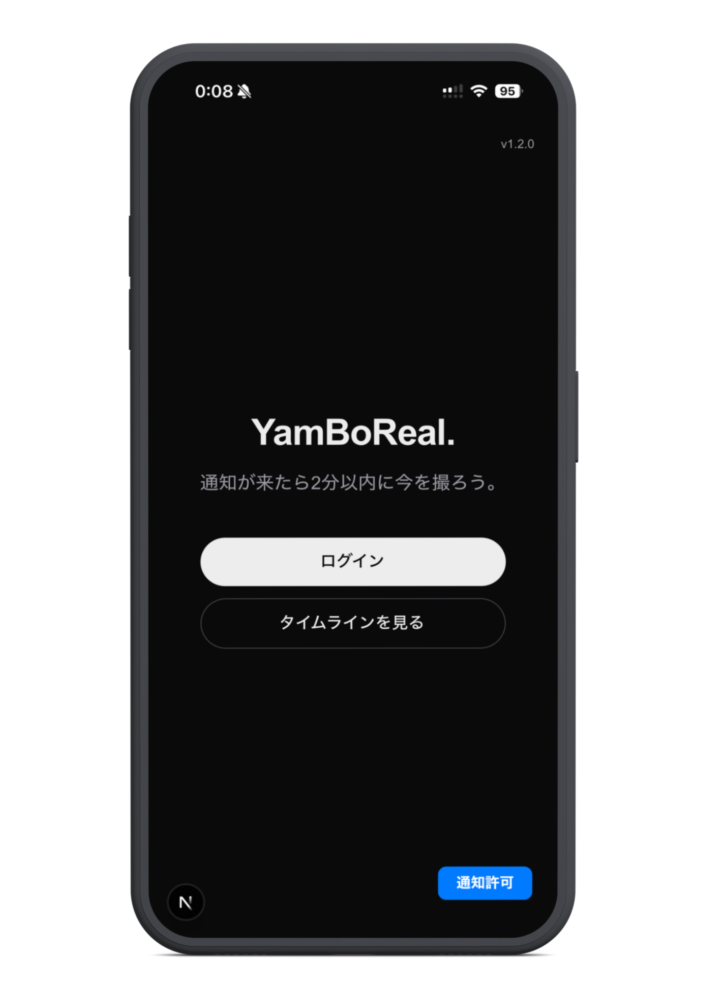
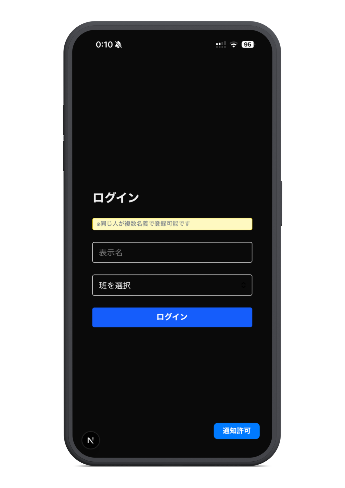
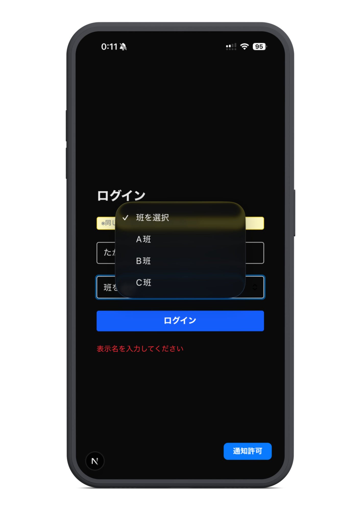

# YamBoReal.

イベント参加者向けの BeReal 風写真共有アプリです。Push 通知をきっかけに、通知から 2 分以内にその瞬間を撮影して投稿し、班ごとにリアルなタイムラインを共有します。

## プロジェクトについて

YamBoReal. は、第3回 KINKI RS YamBoree の参加者向けに作成した、リアルタイム写真共有アプリです。

このアプリの中心にあるのは、「今この瞬間を撮る」という体験です。管理者が Push 通知を送ると、参加者はその通知を合図にカメラを起動し、2 分以内に写真を投稿します。投稿はイベントの空気感をそのまま残すための記録として蓄積され、あとから班ごとのタイムラインとして振り返れます。

## 主な特徴

- 表示名と班を使った簡易ログイン
- Push 通知をきっかけに写真を投稿する体験
- 通知受信から 2 分間だけ撮影できるタイムリミット
- 班情報付きのタイムライン表示
- 日付ごとにまとまった投稿一覧
- イベント期間で投稿を絞り込める表示
- 管理者による一斉通知送信
- PWA 風のホーム画面体験

## アプリの流れ

1. 参加者は表示名と班を登録してログインします。
2. タイムラインを開くと、通知の購読が行われます。
3. 管理者が Push 通知を送ると、参加者の端末に通知が届きます。
4. 通知を受けた参加者は 2 分以内に写真を撮って投稿します。
5. 投稿は班情報つきでタイムラインに並び、イベントの記録として残ります。

## 画面イメージ
### タイムライン画面

<p align="center">
  
</p>

- 日付ごとに投稿がまとまって表示されます。  
- 通知受信後は 2 分間のカウントダウンが表示されます。  
- 班情報付きで投稿が並び、イベントの記録を振り返れます。  
- イベント単位のフィルタで投稿を絞り込めます。

### トップ画面

<p align="center">
  
</p>

- アプリの入口となる画面です。  
- ログインやタイムラインへの導線を案内します。
- 右下の通知許可ボタンを押すことで、Push通知を受け取ることが可能になる

```
⚠️　iPhoneはProgressive Web App(PWA)にすることで通知を受け取ることができる.(iOS16.4 以上)
```


### ログイン画面

<p align="center">
  
  
</p>

- 表示名と班を入力して簡易ログインします。  
- イベント参加者の導線を最小ステップにした画面です。
- 班を選択してプロフィールに紐づけます。  
- 投稿時やタイムライン表示時に班情報として利用されます。
- 表示名、班の入力がないとバリデーションエラーとして表示されます。


## もう少し具体的に

このアプリは、ただ写真を投稿するだけではなく、「通知が来た瞬間の空気」を共有することを目的にしています。通知が来るまで待つ時間、通知が届いてから急いで撮る時間、投稿がタイムラインに並ぶ時間まで含めて、イベントの記録そのものを体験としてデザインしています。

画面の中心になるのはタイムラインです。参加者の写真は班名と一緒に並び、日付ごとに見返しやすく整理されます。イベント単位でのフィルタもあるので、開催中の投稿だけを追うこともできます。
